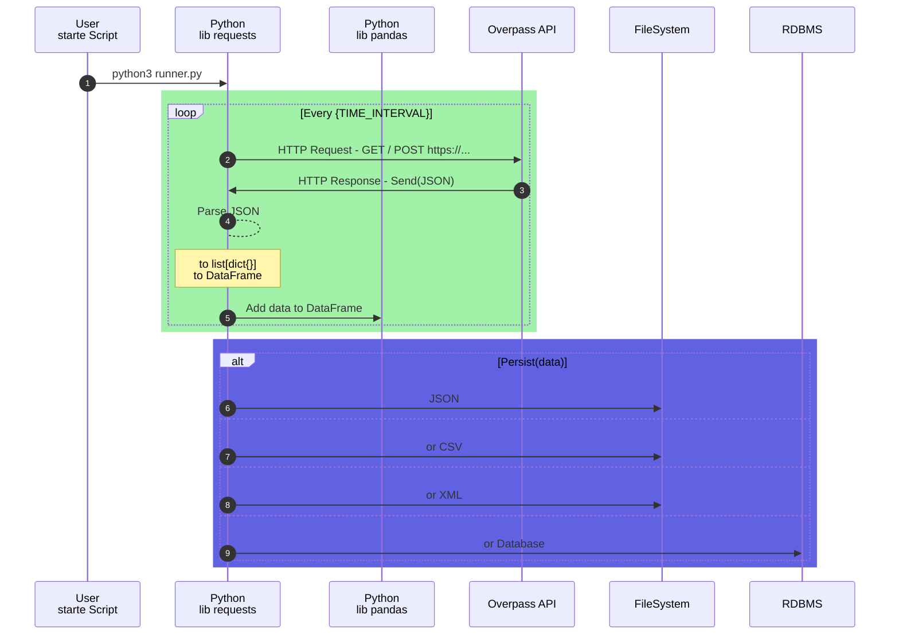
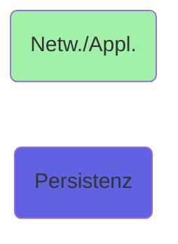

# Abfrage exterer API und Daten-Persistenz: 

```mermaid
sequenceDiagram
    autonumber
    participant Usr as User<br/>starte Script
    participant Py as Python<br/>lib requests
    participant pd as Python<br/>lib pandas
    
    participant Api as Overpass API
    Usr->>Py:python3 runner.py
    rect rgb(161, 241, 168)
        loop Every {TIME_INTERVAL}
            
            Py->>Api: HTTP Request - GET / POST https://...
            Api->>Py: HTTP Response - Send(JSON)
            Py-->Py: Parse JSON
            note over Py: to list[dict{}]<br/>to DataFrame
            Py->>pd: Add data to DataFrame
        end
    end
    rect rgb(96, 98, 226)
        alt Persist(data)
            Py->>FileSystem: JSON 
        else 
            Py->>FileSystem: or CSV 
        else 
            Py->>FileSystem: or XML 
        else 
            Py->>RDBMS: or Database 
        end
    end

```

```mermaid
flowchart LR
    id1(Netw./Appl.)
    id2(Persistenz)
    style id1 fill:#a1f1a8
    style id2 fill:#6062e2

```
