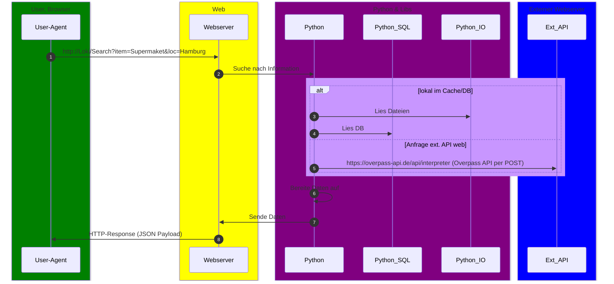

# SMS DA

## Multi-Tier Modell Sc

```mermaid
sequenceDiagram
autonumber
    
    box Green User, Browser
    participant User-Agent
    end

    box Yellow Web
    participant Webserver
    end

    box Purple Python & Libs
    participant Python
    participant Python_SQL
    participant Python_IO
    end

    box Blue Externer Webserver
    participant Ext_API
    end

    User-Agent->>Webserver: http://Loki/Search?item=Supermaket&loc=Hamburg
    Webserver->>Python: Suche nach Information
    rect rgb(200, 150, 255)
    alt lokal im Cache/DB
        Python->>Python_IO:Lies Dateien
        Python->>Python_SQL:Lies DB
    else Anfrage ext. API web
        Python->>Ext_API:  https://overpass-api.de/api/interpreter (Overpass API per POST)
    end
    end
    Python->>Python: Bereite Daten auf
    Python->>Webserver: Sende Daten
    Webserver->>User-Agent: HTTP-Response (JSON Payload)

```

