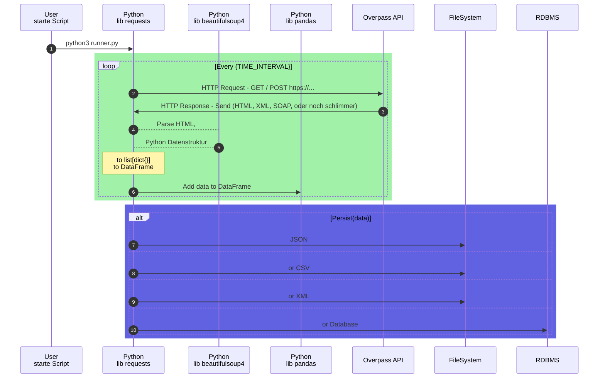
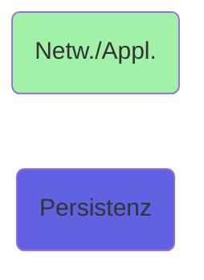

# Web-Scraping 

```mermaid
sequenceDiagram
    autonumber
    participant Usr as User<br/>starte Script
    participant Py as Python<br/>lib requests
    participant SP as Python<br/> lib beautifulsoup4 
    participant pd as Python<br/>lib pandas
    participant Webserver as Overpass API
    Usr->>Py:python3 runner.py
    rect rgb(161, 241, 168)
        loop Every {TIME_INTERVAL}
            
            Py->>Webserver: HTTP Request - GET / POST https://...
            Webserver->>Py: HTTP Response - Send (HTML, XML, SOAP, oder noch schlimmer)
            Py-->SP: Parse HTML, 
            SP-->Py: Python Datenstruktur
            note over Py: to list[dict{}]<br/>to DataFrame
            Py->>pd: Add data to DataFrame
        end
    end
    rect rgb(96, 98, 226)
        alt Persist(data)
            Py->>FileSystem: JSON 
        else 
            Py->>FileSystem: or CSV 
        else 
            Py->>FileSystem: or XML 
        else 
            Py->>RDBMS: or Database 
        end
    end    

```

```mermaid
flowchart LR
    id1(Netw./Appl.)
    id2(Persistenz)
    style id1 fill:#a1f1a8
    style id2 fill:#6062e2

```
