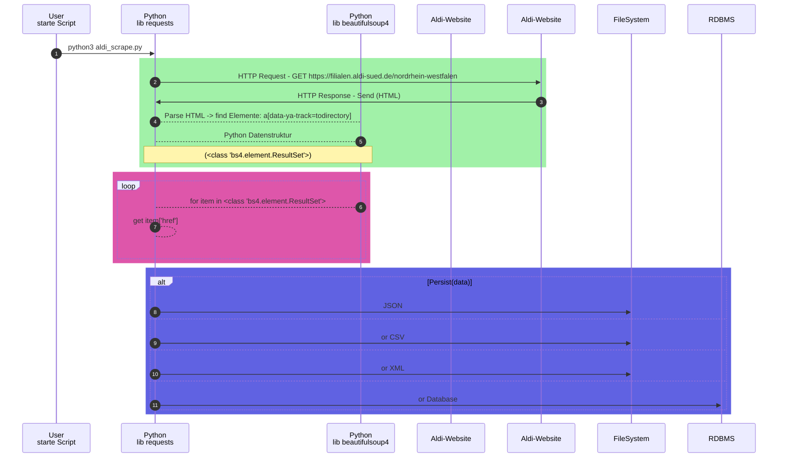

# Webscraping Beispiel Aldi Süd

```mermaid
sequenceDiagram
    autonumber
    participant Usr as User<br/>starte Script
    participant Py as Python<br/>lib requests
    participant SP as Python<br/> lib beautifulsoup4 
    
    participant Webserver as Aldi-Website
    Usr->>Py:python3  aldi_scrape.py  
    rect rgb(161, 241, 168)
            Py->>Aldi-Website: HTTP Request - GET  https://filialen.aldi-sued.de/nordrhein-westfalen
            Aldi-Website->>Py: HTTP Response - Send (HTML)
            Py-->SP: Parse HTML -> find Elemente: a[data-ya-track=todirectory]
            SP-->Py: Python Datenstruktur 
            note over Py, SP: (<class 'bs4.element.ResultSet'>)
    end
    rect rgb(222, 86, 170)
        loop 
            SP-->Py: for item in <class 'bs4.element.ResultSet'>
            Py-->Py: get item['href']
        end
    end
    rect rgb(96, 98, 226)
        alt Persist(data)
            Py->>FileSystem: JSON 
        else 
            Py->>FileSystem: or CSV 
        else 
            Py->>FileSystem: or XML 
        else 
            Py->>RDBMS: or Database 
        end
    end    

```