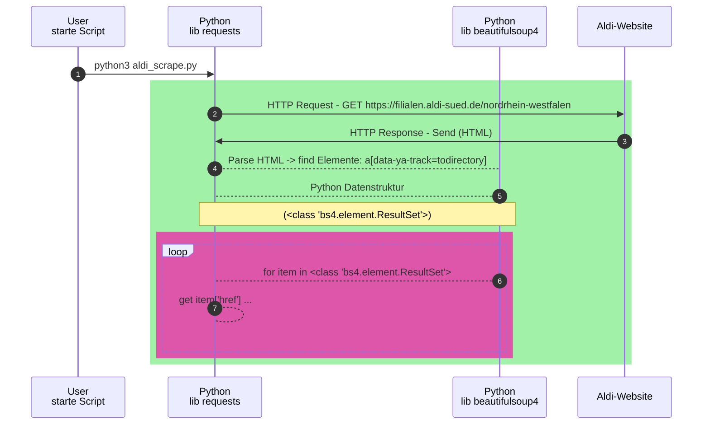
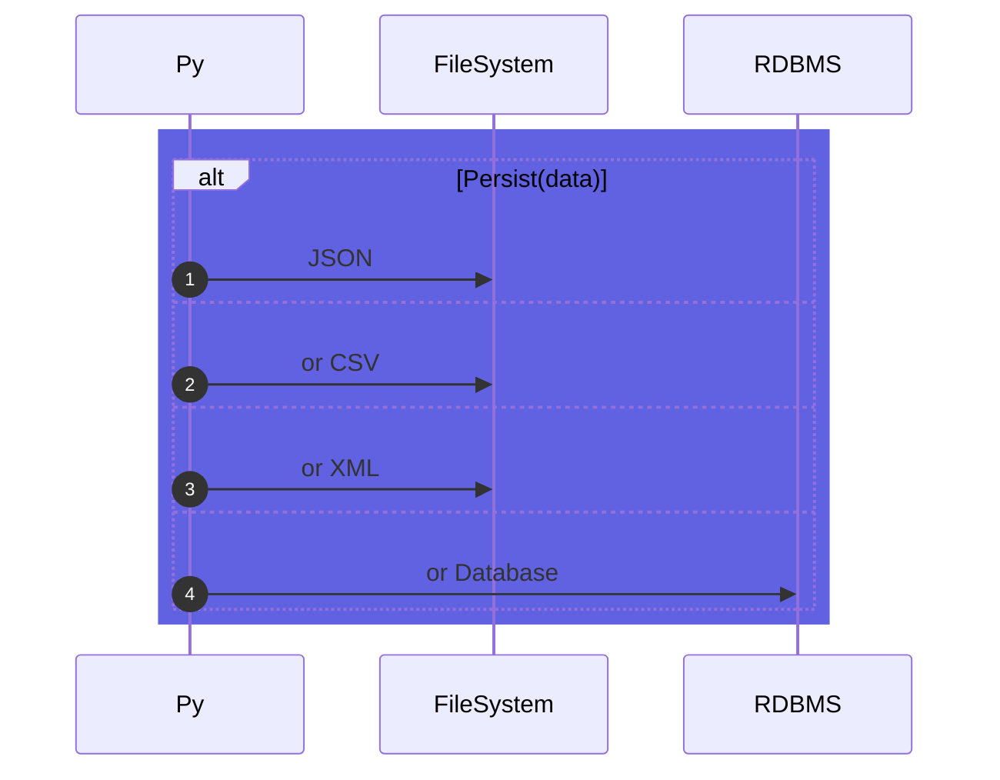

# Webscraping

## Vorbemerkung 

Webscraping meint nicht nur das Absenden von HTTP(s)-Requests und Speichern der erhaltenen Responses, sondern das Parsen des erhaltenen Contents.

### HTML-Parsing ist eklig

Im Bereich des von uns inspizierten Teilbereiches (ehemals <var> WWW </var> genannten) Suchraumes des Internets finden sich zahlreiche Probleme für das Informationsmanagement:
- oft in Form von Markup-Sprachen[^1] - vorrangig HTML!

1. Man kommt mit "normalen" Tools wie (```sed/awk/grep/pcre/pyon re```) nicht weit(er)

2. Es benötigt der Hilfe eines sog. <var>Parser</var>s
    -  In Unkenntnis der indiv. Struktur des Dokumentes betreiben wir also <var>Reverse Engineering</var> und lernen:
        - <u>nicht</u> wohlgeformte Dokumente (welche keine Ausnahme sind) legen Parser "auf die Nase"
            - hier können Tools wie ```tidy``` helfen
        - Die Untersuchung der vorgefundenen (HTML-)Strukturen stellen uns vor das Problem: wir müssen diese untersuchen und können dann
            - a. Geeignete <var>Selektoren</var> formulieren
            - b. Reduntante oder nicht benötigte Informationen ausfiltern


3. Exotischere Websites, deren Inhalt per ECMA-Script[^2] via JSON-Blob und zig externer Ressourcen gerendert werden, wurden hierbei nicht betrachtet


### Webscraping Beispiel Aldi Süd




## Datenpersistenz



--- 

[^1]: Meist Abkömmlinge des SGML oder XML: HTML, XHMTL oder schlimmmeres à la SOAP[^3]

[^2]: ECMA-262 ist der Standard, in welchem Scriptsprache deren Ursprung [Javascript](https://en.wikipedia.org/wiki/JavaScript) ist (Typescript, JScript et al.) festgeschrieben sind


[^3]:  Gott sei bei uns! 